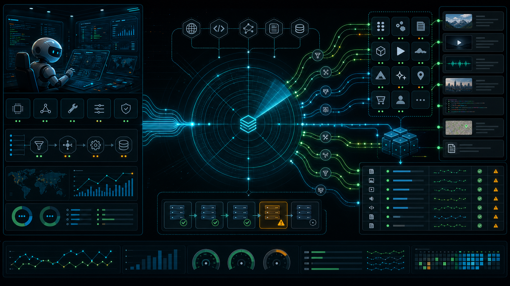

<div align="center">
  <h1>Radar Claw</h1>
  <p><b>Data-collection tool layer for Qianfeng AI / Hermes Agent workflows.</b></p>
  <p><b>AI 员工背后的采集执行层：接收工具调用，调度 Beeclaw，保存原始内容，并返回可追踪执行结果。</b></p>
  <a href="package.json"></a>
  <a href="package.json">=18"></a>
  <a href="requirements.txt"></a>
  <a href="LICENSE"></a>
</div>



## Why

Radar Claw is not the end-user product UI. The product entry is the Qianfeng / Hermes AI employee. Radar runs behind that employee: it receives MCP or CLI tool calls, creates collection tasks, calls Beeclaw platform providers, stores raw content and media metadata, and returns structured `agent_feedback` for the AI employee to explain what happened.

This keeps collection disciplined. The agent asks for data, Radar records the task, selects a provider/backend, stores the raw result, exposes retries and exports, and leaves optional organization, translation, summarization, OCR, classification, scoring, and publishing to downstream workflows.

## What It Does

| Surface | Capability |
|---|---|
| AI employee tool layer | MCP tools and command-style Beeclaw CLI for collection workflows |
| Task execution | Collection task creation, queued child tasks, retry, cancellation, and worker processing |
| Provider routing | Beeclaw public routes with backend fallback and `backend_attempts` traceability |
| Raw data store | SQLite storage for raw text, source URLs, media metadata, metrics, payloads, failures, and reports |
| Media workflow | Media asset metadata, optional local download, retry, and export manifests |
| Platform MCP bridge | Platform-managed MCP Gateway calls for backend integrations such as X MCP and 小红书 MCP |
| Handoff | Raw dataset export, organizer handoff, and golden interaction window candidate handoff |
| Diagnostics | Provider catalog, provider health, production readiness, MCP integration visibility, and X pressure test |

## Architecture

```text
User
  -> Qianfeng / Hermes AI employee
  -> Radar MCP tools or Beeclaw CLI
  -> Radar collection task
  -> Beeclaw provider route
  -> backend MCP / API / CLI / RSS / browser-session fallback
  -> external platform
  -> Radar raw data store
  -> agent_feedback / export / optional downstream handoff
```

Radar remains the source of truth for raw collected data. Downstream employees can organize or score content, but they consume Radar IDs, exports, and handoff payloads instead of re-crawling the same source.

## Platform Coverage

Radar exposes Beeclaw as the public provider engine. The upstream `feedgrab` package is a replaceable backend behind Beeclaw, not the product-facing provider namespace.

| Route | Current backend behavior |
|---|---|
| `beeclaw:x` | Auto-selects `x_mcp`, `x_api`, `twitterapi_io`, `x_rss`, then browser-session backends |
| `beeclaw:xhs` | Uses XHS MCP / CLI / universal reader paths depending on configuration |
| `beeclaw:youtube` | Uses `yt-dlp`, YouTube API, RSS, or fallback readers |
| `beeclaw:github` | Uses `gh`, GitHub API, or universal reader fallback |
| `beeclaw:reddit` | Uses `rdt-cli`, Reddit API, or universal reader fallback |
| `beeclaw:rss` | Parses RSS/Atom and stores each feed entry as its own raw content row |
| `beeclaw:web` | Uses Jina Reader, agent-browser, or universal reader fallback |
| URL/content routes | XHS, WeChat, YouTube, Bilibili, Douyin, Weibo, Zhihu, GitHub, Feishu, Kdocs, Youdao, RSS, Telegram, Reddit, HackerNews, Medium, LinuxDo, IDCFlare, Xiaoyuzhou, Ximalaya, and generic web URLs |

In task feedback, `provider` is the public Radar route such as `beeclaw:x` or `beeclaw:github`; `execution_backend` records the selected backend such as `x_mcp`, `x_api`, `twitterapi_io`, `x_rss`, `Jina Reader`, `yt-dlp`, `gh`, `xhs-cli`, `rdt-cli`, `rss_parser`, or `beeclaw:universal_reader`.

## Install

NPX one-command install from GitHub:

```bash
npx github:Zanetach/radar-claw install
```

This installs the package into `~/.beeclaw-radar`, runs the unified installer, and starts the Radar API service automatically.

Doctor check:

```bash
npx github:Zanetach/radar-claw doctor
```

Shell one-liner for agent runtimes that prefer `curl`:

```bash
curl -fsSL https://raw.githubusercontent.com/Zanetach/radar-claw/main/install.sh | bash
```

Install without service autostart:

```bash
npx github:Zanetach/radar-claw install --no-start
```

Local checkout install:

```bash
./tools/install_beeclaw.sh
```

This creates or updates the Python runtime, installs Beeclaw backend wrappers, installs Hermes Radar skills/MCP config, optionally starts the Radar API service, and runs a local doctor check.

## Run

Start the local Radar API:

```bash
./tools/install_beeclaw.sh start-api
```

Default API URL:

```text
http://127.0.0.1:8780
```

Health check:

```bash
curl --noproxy '*' http://127.0.0.1:8780/api/summary
```

Process queued collection tasks once:

```bash
python3 -m crawler worker --limit 10
```

Run a polling worker:

```bash
python3 -m crawler worker --daemon --limit 0 --poll-interval 5 --idle-limit 0 --retry-delay 60
```

## MCP Tools

Radar exposes MCP tools through:

```bash
python3 tools/radar_mcp_server.py
```

Common tool groups:

| Group | Tools |
|---|---|
| Collection | `radar_agent_collect`, `radar_create_collection_task`, `radar_get_collection_task`, `radar_retry_collection_task`, `radar_update_task_status` |
| Raw data | `radar_list_raw_contents`, `radar_get_raw_content_detail`, `radar_export_raw_dataset` |
| Media | `radar_list_media_assets`, `radar_retry_media_asset`, `radar_retry_media_assets`, `radar_export_media_assets` |
| Providers | `radar_list_providers`, `radar_check_provider_health`, `radar_check_production_readiness`, `radar_xmcp_pressure_test` |
| MCP visibility | `radar_list_mcp_integrations` |
| Handoff | `radar_handoff_to_interaction_agent`, `radar_save_interaction_candidates`, `radar_export_interaction_candidates`, `radar_push_interaction_candidates`, `radar_handoff_to_organizer` |

Use MCP inside Hermes when tool discovery is available. Use CLI when an Agent runtime only supports shell commands, cron jobs, or server scripts.

## Beeclaw CLI

Beeclaw CLI is a command-style adapter over the same Radar HTTP API:

```bash
./tools/beeclaw provider list --platform rss
./tools/beeclaw chat "采集 @OpenAI 最近 7 天原创 X 内容，保留图片和视频"
./tools/beeclaw chat "采集 @OpenAI 最近 7 天原创 X 内容，保留图片和视频" --json
./tools/beeclaw collect --url https://example.com/feed.xml --platform rss --json
./tools/beeclaw task get <task_id> --json
```

If Radar API is not running, the CLI exits non-zero and prints the startup command:

```bash
./tools/run_radar_api.sh
```

## Backend Configuration

Production MCP Manager/Gateway configuration is injected by the platform. Use generic variable names by default; `QF_MCP_*` aliases are accepted for Qianfeng deployments.

```bash
RADAR_BACKEND_MCP_MODE=platform_gateway
MCP_MANAGER_NAME=platform-mcp-manager
MCP_MANAGER_DISPLAY_NAME="Platform MCP Manager"
MCP_MANAGER_MANAGED_BY=platform_runtime
PLATFORM_MCP_GATEWAY_URL=https://platform.example.com/mcp-gateway
PLATFORM_MCP_WORKSPACE_ID=<workspace-id>
PLATFORM_MCP_RUNTIME_TOKEN=<runtime-secret>
```

Optional X browser-session fallback supports cloud, headless, or local modes:

```bash
export BEECLAW_X_BROWSER_SESSION_MODE=cloud
export BEECLAW_X_BROWSER_ENDPOINT='https://browser-worker.example.com/x/profile-posts'
export BEECLAW_X_BROWSER_API_KEY='<secret>'

export BEECLAW_X_BROWSER_SESSION_MODE=headless
export BEECLAW_X_BROWSER_CMD='/opt/beeclaw/x-browser --json {handle} {max_results}'

export BEECLAW_X_BROWSER_SESSION_MODE=local
export WEBBRIDGE_URL='http://127.0.0.1:10086'
```

Local CLI backend command lines can be overridden:

```bash
export BEECLAW_XHS_CLI_CMD='/opt/beeclaw/xhs-cli --json {url}'
export BEECLAW_RDT_CLI_CMD='/opt/beeclaw/rdt-cli --json {url}'
export BEECLAW_AGENT_BROWSER_CMD='/opt/agent-browser/extract --json {url}'
```

Secrets must stay in platform Secrets, local ignored env files, or Hermes Secrets. Do not commit tokens.

## Golden Interaction Window

Radar can support an AI employee workflow for finding useful reply or quote opportunities:

```text
set target accounts / keywords
  -> collect posts, media, and metrics through Radar
  -> hand selected raw content to Hermes interaction scoring
  -> save window scores and reply / quote suggestions
  -> export or mark pushed to table / Feishu / storage workflows
```

Radar stores generated candidates in `interaction_candidates`. It does not auto-reply, auto-quote, like, follow, or perform any X write action.

## Verify

Run backend tests:

```bash
python3 -m unittest discover -s tests -v
```

Check package contents:

```bash
npm pack --dry-run --json
```

Smoke-test real platform routes through Radar API:

```bash
./tools/beeclaw_platform_smoke.py --platforms all --types url,account,keyword
./tools/beeclaw_platform_smoke.py --execute --platforms web,rss,github,youtube,reddit --types url --limit 2
./tools/beeclaw_platform_smoke.py --execute --platforms web --types url --backend agent-browser
```

For platforms without public default samples, provide real test inputs through environment variables such as `BEECLAW_SMOKE_XHS_URL`, `BEECLAW_SMOKE_WECHAT_URL`, `BEECLAW_SMOKE_X_ACCOUNT`, or `BEECLAW_SMOKE_YOUTUBE_KEYWORD`.

## Security

The repository intentionally ignores local runtime state and secrets:

```text
.env
tools/xmcp/.env
.external/
.chrome-webbridge-profile/
data/
feishu_workspace/
```

Only commit source code, docs, tests, scripts, and non-secret examples.

## Repository Layout

```text
crawler/                                  # Python backend, database, providers, storage, worker, HTTP API
tools/radar_mcp_server.py                 # Hermes / Qianfeng MCP server exposing Radar tools
tools/beeclaw                             # command-style adapter over Radar HTTP API
tools/beeclaw-bin/                        # project-local backend CLI wrappers
tools/install_beeclaw.sh                  # unified local installer
tools/npx-install.mjs                     # GitHub NPX installer
tools/hermes_skills/                      # Hermes skill definitions
docs/                                     # PRD, deployment, workflow, and architecture documentation
tests/                                    # unit tests for backend, providers, MCP tools, CLI, and workflows
```

## Docs

- [Beeclaw unified install and usage](docs/Beeclaw统一安装与使用手册.md)
- [Agent browser and real platform smoke testing](docs/Beeclaw-agent-browser与真实平台测试.md)
- [Qianfeng AI Radar PRD](docs/千蜂AI-Radar数据采集工具PRD.md)
- [Current capability and flow](docs/radar-current-capability-and-flow.md)
- [Data collection agent implementation plan](docs/数据采集Agent落地方案.md)

## License

Radar Claw is source-visible for non-commercial use. See [LICENSE](LICENSE) for the full non-commercial license terms.
