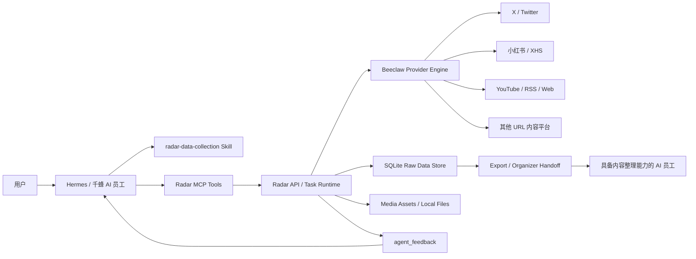

# 千蜂 AI · Radar 数据采集工具 PRD

版本：2026-05-14

## 1. 产品定位

Radar 是千蜂 AI Agent Runtime 中的标准数据采集工具。它不是面向普通用户的独立 Web 产品，也不是内容整理/发布系统。用户入口是 AI 员工；AI 员工通过 Hermes MCP tools 调用 Radar，Radar 负责执行采集、保存原始数据、返回结构化结果。

一句话定位：

```text
用户 / AI 员工发起采集需求
-> Radar 创建一次采集任务
-> Beeclaw provider engine 执行抓取
-> 原始内容、媒体、指标和 raw payload 入库
-> Radar 返回 agent_feedback
-> 可选交给具备内容整理能力的 AI 员工
```

Radar 的核心价值是把“外部平台数据采集”标准化成 AI 员工可调用的工具能力，供千蜂 AI 创建的数据采集类员工复用。

## 2. 当前真实项目状态

当前项目已经从“演示型后台”调整为“Agent 背后的采集工具层”：

- 产品入口：AI Agent / Hermes / 千蜂 AI 员工。
- 用户不直接使用 Radar Web；Radar Web 已移除用户入口，只保留 HTTP API、MCP tools、Skill、文档和测试。
- Beeclaw 已作为 Radar 对外 provider engine 接入；upstream feedgrab 作为可替换 backend 保留。
- X 平台对外统一为 `beeclaw:x`，默认 `mode=auto` 自动选择 `x_mcp`、`x_api`、`x_rss`；账号级采集和关键词 recent search 已进入同一采集闭环。
- X MCP 已提供真实 credits 压测入口，可先估算账号数和 API 调用量，再按需创建 queued batch 任务。
- 非 X 平台当前优先支持 URL/content 采集闭环，统一走 Beeclaw URL provider。
- 采集结果保存到 SQLite，后续可扩展同步飞书多维表/云盘。
- Radar v1 只负责采集执行和原始数据沉淀。翻译、OCR、分类、质量判断属于内容整理能力，发布属于发布能力；这些能力可以绑定在同一个 AI 员工上，也可以拆成内容整理型 AI 员工、发布型 AI 员工分别处理。

## 3. 总体架构



核心链路：

```text
用户指令
-> Hermes / 千蜂 AI 员工
-> Radar MCP Tools
-> Radar Collection Task
-> Beeclaw Provider Engine
-> 外部平台
-> 原始内容 / 媒体 / 指标入库
-> agent_feedback 返回 AI 员工
```

### 3.1 核心组件职责

| 组件 | 职责 | 不负责 |
| --- | --- | --- |
| Hermes / 千蜂 AI 员工 | 理解用户意图，选择 Radar 工具，向用户反馈结果 | 直接读写 Radar 数据库 |
| `radar-data-collection` Skill | 约束 AI 员工按采集流程调用工具 | 平台抓取实现 |
| Radar MCP Tools | 对 Hermes 暴露采集、查询、导出、交接工具 | 大模型推理 |
| Radar API / Task Runtime | 创建任务、调用 provider、入库、生成反馈 | 长周期定时调度 |
| Beeclaw Provider Engine | 统一管理平台 provider 和抓取动作 | 内容整理、发布 |
| SQLite Raw Data Store | 保存任务、原始内容、媒体 metadata、raw payload | 作为最终业务中台数据库 |
| Media Assets | 保存图片、视频等媒体 metadata 和可选本地下载结果 | 保证所有平台都可下载原始视频 |
| Interaction Candidates | 保存 Hermes 生成的黄金互动窗口评分、回复/引用建议和推送状态 | 自动在外部平台评论、转发、点赞 |
| 内容整理型 AI 员工 / Organizer 能力 | 读取已采集数据，做翻译、OCR、摘要、分类、评分 | 重新触发采集 |

## 4. 用户角色

### 4.1 平台管理员

负责配置：

- 平台 MCP Manager / Gateway。
- X MCP、小红书 MCP 等 backend MCP 集成。
- X API token / credits 等平台侧 secret。
- Beeclaw provider engine、upstream feedgrab backend 依赖和运行环境。
- 媒体存储路径。
- Hermes MCP server 和 Radar Skill。
- 后续飞书、云盘、对象存储等外部存储。

管理员不参与日常采集操作。

### 4.1.1 平台 MCP Manager 与集成可见性

千蜂 AI 平台是 MCP 控制面。图中的 `MCP Manager` 是千蜂平台 MCP 管理功能，负责接入、部署、鉴权、tool allowlist、健康检查和服务端工具代理。Radar 不保存这些平台 token，不重新实现 MCP 配置中心；Radar 只作为采集工具执行面，通过平台 MCP Manager/Gateway 调用已配置的 backend MCP。

千蜂 MCP 集成页需要同时显示 Radar 和 backend MCP：

| MCP | 类型 | 默认绑定 AI 员工 | 用途 |
| --- | --- | --- | --- |
| Radar MCP | `agent_tool` | 是 | AI 员工调用的业务工具入口，负责采集任务、入库、查询、导出和反馈 |
| X MCP | `backend` | 否 | 平台管理的后端连接器；Radar 通过 MCP Manager/Gateway 调用它完成 `beeclaw:x` 采集 |
| 小红书 MCP | `backend` | 否 | 平台管理的后端连接器；Radar 通过 MCP Manager/Gateway 调用它完成 `beeclaw:xhs` 采集 |

平台可通过 `GET /api/mcp/integrations` 或 MCP 工具 `radar_list_mcp_integrations` 获取上述列表。生产采集默认通过 Radar MCP 间接调用 backend MCP，不把 X/小红书等原始 tools 直接暴露给普通 AI 员工。

Radar 运行时由平台注入 MCP Manager/Gateway 配置。默认使用抽象环境变量；千蜂部署可以继续使用 `QF_MCP_*` 兼容别名，但代码和接口不能写死 `qianfeng-mcp-manager`。

```bash
RADAR_BACKEND_MCP_MODE=platform_gateway
MCP_MANAGER_NAME=platform-mcp-manager
MCP_MANAGER_DISPLAY_NAME="Platform MCP Manager"
MCP_MANAGER_MANAGED_BY=platform_runtime
PLATFORM_MCP_GATEWAY_URL=<platform-mcp-gateway-url>
PLATFORM_MCP_WORKSPACE_ID=<workspace-id>
PLATFORM_MCP_RUNTIME_TOKEN=<runtime-secret>
```

Radar 调用模型：

```json
{
  "integration": "x-mcp",
  "tool": "searchPostsRecent",
  "arguments": {"query": "from:elonmusk", "max_results": 20},
  "trace_id": "collection-task-id"
}
```

`PLATFORM_MCP_RUNTIME_TOKEN` 只用于服务到平台网关的鉴权，不进入数据库、运行报告或 `agent_feedback`。

### 4.2 AI 员工创建者

在千蜂 AI 中创建 AI 员工，并为该员工绑定 Radar 数据采集工具。

典型员工：

- 数据采集员工。
- 市场情报员工。
- 竞品监测员工。
- 行业资讯监测员工。

### 4.3 AI 员工 / 数据采集员工

通过对话接收用户需求，并调用 Radar tools：

- 解析采集意图。
- 创建采集任务。
- 查询任务结果。
- 返回采集报告。
- 按需把原始数据交给内容整理能力。

### 4.4 内容整理型 AI 员工 / Organizer 能力

读取 Radar 原始数据，负责：

- 翻译。
- OCR。
- 摘要。
- 分类。
- 质量评分。
- 内容清洗。
- 发布建议。

它和数据采集员工是同一种 runtime 类型，区别只在于角色说明、Skill、工具权限和工作边界。它可以是独立员工，也可以是同一个 AI 员工绑定额外整理能力。

## 5. 核心使用流程

### 5.1 单次采集

用户对 AI 员工说：

```text
抓取 @elonmusk 最近 7 天原创 X post，包含图片和视频
```

执行流程：

1. AI 员工读取 `radar-data-collection` Skill。
2. 调用 `radar_check_provider_health` 检查 Beeclaw、upstream feedgrab backend、X MCP、媒体目录等状态。
3. 优先调用 `radar_agent_collect`，传入用户原始指令。
4. Radar 解析平台、账号、URL、时间范围、媒体需求、过滤条件。
5. Radar 创建 collection task / crawl run。
6. Radar 调用对应 provider 执行采集。
7. Radar 保存原文、链接、指标、媒体 asset metadata、raw payload。
8. Radar 返回 `agent_feedback`。
9. AI 员工把 `agent_feedback.message` 回复给用户。
10. 用户需要整理时，AI 员工调用 `radar_handoff_to_organizer`。

### 5.2 URL/content 采集

用户对 AI 员工说：

```text
采集这个 GitHub 项目 https://github.com/iBigQiang/feedgrab
```

Radar 行为：

- 根据 URL 识别平台为 `github`。
- 执行 `beeclaw:github` 路由。
- 优先使用 `gh` backend 读取 repo 元数据；不可用时回落到 `beeclaw:universal_reader`。
- 保存原始内容。
- `agent_feedback.top_contents` 返回：
  - `provider=beeclaw:github`
  - `execution_backend=gh` 或 `beeclaw:universal_reader`

### 5.3 定时采集

用户对 AI 员工说：

```text
每天 10 点抓取 @OpenAI 最近 24 小时推文
```

边界：

- Hermes / 千蜂 AI Agent runtime 负责定时调度。
- Radar 不内置 cron。
- Radar 不主动循环执行。
- Radar 只返回调度契约。

Radar 返回：

```json
{
  "agent_feedback": {
    "status": "requires_runtime_schedule",
    "runtime_schedule": {
      "owner": "hermes_agent_runtime",
      "radar_executes_schedule": false,
      "execution_tool": "radar_create_collection_task",
      "execution_payload": {
        "identifier": "OpenAI",
        "platform": "x",
        "date_range": "24h"
      }
    }
  }
}
```

AI Agent runtime 根据 `runtime_schedule` 创建定时任务，到点调用 `radar_create_collection_task`。

## 6. 平台能力范围

### 6.1 当前生产优先级

```text
X -> YouTube -> RSS/Web -> 小红书 -> 微信公众号 -> B站/抖音/微博 -> Reddit/Telegram
```

### 6.2 当前已接入能力

| 平台 | 当前能力 | 说明 |
| --- | --- | --- |
| X / Twitter | 账号采集、关键词 recent search、RSS fallback、X MCP、API、credits 压测入口 | 对外 `beeclaw:x`，默认 `auto` 自动选择 `x_mcp -> x_api -> x_rss`；仍兼容显式 `beeclaw:x_mcp` |
| YouTube | 账号 RSS / URL content | 可无 token 获取基础视频元数据 |
| 小红书 / XHS | URL/content、关键词搜索、`xhs-cli` URL backend | 关键词搜索已走 `beeclaw:xhs`，URL 采集优先 `xhs-cli`，底层可降级到 feedgrab XHS search / UniversalReader |
| 微信公众号 / WeChat | URL/content | 账号级深度采集待增强 |
| Bilibili | URL/content | 账号级/关键词级待增强 |
| 抖音 / Douyin | URL/content | 依赖公开 URL 可读性 |
| 微博 / Weibo | URL/content | 无 URL 的关键词/账号请求会要求用户补 URL |
| 知乎 / Zhihu | URL/content | 账号级/关键词级待增强 |
| GitHub | URL/content | 已验证可采集 GitHub repo 页面 |
| 飞书 / Feishu | URL/content | 私有文档需要授权或公开链接 |
| 金山文档 / Kdocs | URL/content | 私有文档需要授权或公开链接 |
| 有道云笔记 / Youdao | URL/content | 私有笔记需要授权或公开链接 |
| RSS | feed URL | RSS/Atom/feed 地址 |
| Telegram | URL/content | 优先公开频道 URL |
| Reddit | URL/content、`rdt-cli` URL backend | URL 采集优先 `rdt-cli`，账号级/关键词级待增强 |
| HackerNews | URL/content | HN item/page |
| Medium | URL/content | 文章 URL |
| LinuxDo | URL/content | topic/page URL |
| IDCFlare | URL/content | article/page URL |
| 小宇宙 | URL/content | episode/page URL |
| 喜马拉雅 | URL/content | sound/episode URL |
| 通用 Web URL | URL/content | 通用网页读取 |

### 6.3 非 X 平台约束

非 X 平台当前默认是 URL/content 采集。如果用户只提供“账号名”或“关键词”，而该平台尚未接入深度 provider，Radar 不创建失败采集任务，而是返回 `requires_input`，要求补充具体 URL。

示例：

```text
抓取微博上雷军最近 10 条内容
```

Radar 返回：

```json
{
  "status": "requires_input",
  "required_input": "url",
  "message": "weibo 当前只接入 Beeclaw URL/content 采集，尚未接入 keyword 深度采集。请提供具体内容链接或主页链接后再采集。"
}
```

## 7. Provider 设计

### 7.1 Provider 路由与执行器

Radar 区分两个概念：

- `provider`：Radar 对外暴露的 Beeclaw 采集路由，例如 `beeclaw:github`。
- `execution_backend`：对 AI 员工暴露的 Beeclaw 执行器，例如 `beeclaw:universal_reader`。

原因：

- 业务侧需要知道内容来自哪个平台路由。
- 工程侧需要知道实际是哪个 reader 执行，方便排查失败。

示例：

```json
{
  "provider": "beeclaw:github",
  "execution_backend": "beeclaw:universal_reader"
}
```

生产排障还会返回 `backend_attempts`。例如 `xhs-cli` 不可用时：

```json
[
  {"backend": "xhs-cli", "status": "failed", "error": "xhs-cli is not installed"},
  {"backend": "beeclaw:universal_reader", "status": "success"}
]
```

AI 员工应把最终结果、失败 backend 和 fallback 说明反馈给用户，而不是只说“采集成功”。

### 7.2 X provider 优先级

默认 X 通道为 `auto`，不是强制 XMCP。`auto` 的尝试顺序：

```text
beeclaw:x(auto) -> x_mcp -> x_api -> x_rss
```

说明：

- `auto` 是 X 默认模式，适合 AI 员工自然语言采集；对外 provider 统一展示为 `beeclaw:x`。
- `x_mcp` 是自动路由首选 backend；生产环境优先通过配置的 Platform MCP Manager/Gateway 调用平台已接入的 `X MCP`，本地开发可继续使用 `XMCP_SERVER_URL`。
- `x_mcp` 账号级采集：按账号读取最近内容，入库正文、指标、图片/视频 metadata。
- `x_mcp` 关键词采集：通过 `searchPostsRecent` 查询 recent posts，再映射为 Radar 原始内容。
- X MCP credits 压测：通过 `radar_xmcp_pressure_test` 先用 `execute=false` 估算调用量，再用 `execute=true` 创建 queued batch。
- `x_rss` 是无 token fallback；返回时会提示指标或视频 metadata 可能不完整。
- X MCP 仍消耗 X API credits。
- browser/chrome session 仅作为显式调试模式，不进入默认生产 auto 顺序。

推荐 X MCP allowlist：

```bash
X_API_TOOL_ALLOWLIST="getUsersByUsername,getUsersPosts,getUsersIdPosts,getPosts,searchPostsRecent"
```

### 7.3 URL / 内容平台

当前通过 Beeclaw 暴露。对外是稳定 provider，内部 backends 可以替换：

```text
beeclaw:x
  backends: x_mcp, x_api, x_rss, twitter-cli, browser_session
beeclaw:youtube
  backends: yt-dlp, youtube_api, rss
beeclaw:xhs
  backends: xiaohongshu-mcp, xhs-cli, universal_reader
beeclaw:reddit
  backends: rdt-cli, reddit_api, universal_reader
beeclaw:github
  backends: gh, github_api, universal_reader
beeclaw:rss
  backends: rss_parser, universal_reader
beeclaw:web
  backends: Jina Reader, universal_reader
beeclaw:wechat
beeclaw:bilibili
beeclaw:douyin
beeclaw:weibo
beeclaw:zhihu
beeclaw:feishu
beeclaw:kdocs
beeclaw:youdao
beeclaw:telegram
beeclaw:hackernews
beeclaw:medium
beeclaw:linuxdo
beeclaw:idcflare
beeclaw:xiaoyuzhou
beeclaw:ximalaya
```

非 X 平台第一阶段优先保证 URL/content 采集闭环。账号级、关键词级深度采集按平台逐步增强；未接深度 backend 时走 `universal_reader`，不得对 AI 员工伪装成已具备完整账号级采集。

当前已接入可执行 backend：

- `beeclaw:web -> Jina Reader`：将通用网页转为可读文本。
- `beeclaw:youtube -> yt-dlp`：读取视频标题、描述、播放/互动指标和缩略图 metadata。
- `beeclaw:github -> gh`：读取 repo 描述、star、fork、语言和更新时间。
- `beeclaw:xhs -> xhs-cli`：读取小红书笔记标题、正文、互动和图片/视频 metadata。
- `beeclaw:reddit -> rdt-cli`：读取 Reddit thread 标题、正文、score、评论数和 subreddit metadata。
- `beeclaw:rss -> rss_parser`：内置解析 RSS 2.0、Atom 和 RDF feed，按 entry 拆成多条原始内容入库，并保留标题、链接、发布时间、摘要和 media enclosure metadata。
- 所有 URL/content 路由仍保留 upstream feedgrab `UniversalReader` 兜底。

## 8. 数据模型与存储

### 8.1 核心表

- `source_accounts`：账号源。
- `source_contents`：原始内容。
- `crawl_runs`：采集任务记录。
- `crawl_run_contents`：任务与内容的精确关联。
- `crawl_failures`：失败记录。
- `crawl_strategies`：采集策略。
- `media_assets`：媒体资产记录。

### 8.2 任务记录

表：`crawl_runs`

关键字段：

- `id`
- `agent_type`
- `source_type`
- `platform`
- `mode`
- `status`
- `input_label`
- `params_json`
- `report_json`
- `saved_count`
- `failure_count`
- `media_downloaded`
- `media_failed`

### 8.3 原始内容字段

表：`source_contents`

关键字段：

- `platform`
- `provider`
- `original_content_id`
- `title`
- `text`
- `original_text`
- `published_at`
- `url`
- `view_count`
- `like_count`
- `comment_count`
- `share_count`
- `media_type`
- `media_assets_json`
- `raw_payload_json`
- `qualification_status`
- `organize_status`
- `review_status`
- `publish_status`

### 8.4 媒体资产

表：`media_assets`

关键字段：

- `content_id`
- `run_id`
- `platform`
- `provider`
- `original_content_id`
- `asset_index`
- `media_type`
- `url`
- `download_url`
- `thumbnail_url`
- `local_path`
- `download_status`
- `error_message`
- `retry_count`

`source_contents.media_assets_json` 继续作为兼容镜像，`media_assets` 表用于后续媒体重试、导出和对象存储同步。

如果媒体下载失败，任务不应整体失败；失败项进入 run report，同时 `media_assets.download_status=failed`，可通过媒体重试接口再次处理。

### 8.5 Raw Content Contract

```json
{
  "content_id": 1,
  "platform": "github",
  "provider": "beeclaw:github",
  "execution_backend": "beeclaw:universal_reader",
  "source_account": "GitHub",
  "original_content_id": "abc123",
  "source_url": "https://github.com/iBigQiang/feedgrab",
  "title": "万能内容抓取器",
  "original_text": "...",
  "published_at": null,
  "metrics": {
    "views": null,
    "likes": null,
    "comments": null,
    "reposts": null
  },
  "media_type": "text",
  "media_assets": [],
  "raw_payload": {}
}
```

## 9. 任务队列和 Worker

默认采集接口仍支持同步执行，便于本地调试和小任务实时反馈。大任务可以通过队列模式创建：

```json
{
  "url": "https://github.com/Zanetach/radar-claw",
  "queue": true
}
```

执行流程：

```text
POST /api/collection-tasks queue=true
-> crawl_runs.status=queued
-> worker claim queued run
-> crawl_runs.status=running
-> 执行 Beeclaw provider
-> 写入 source_contents / media_assets
-> crawl_runs.status=success / partial_success / failed
```

批量 URL 采集使用同一个入口，Radar 会自动拆成父任务和子任务：

```json
{
  "urls": [
    "https://example.com/a",
    "https://example.com/b"
  ],
  "platform": "web",
  "queue": true
}
```

数据模型：

- 父任务：`crawl_runs.source_type=batch`，负责聚合总数、成功数、失败数和报告。
- 子任务：`crawl_runs.parent_run_id=<父任务ID>`，每个 URL 一个 queued 子任务。
- Worker：只领取非 batch 的 queued 子任务；子任务完成后刷新父任务状态。
- 取消/暂停：父任务被 `cancelled` 或 `paused` 时，未执行的 queued 子任务会同步更新状态。
- 运行中取消：调用 `radar_update_task_status(status=cancelled)` 后，账号循环会在下一个账号前停止，最终 `finish_run` 不会把状态覆盖回 `success`；已经进入外部 provider 的单次阻塞调用需要等待该调用返回。

已导入的 Excel / 账号源也使用同一套父子任务模型。调用方只传平台、分类或数量限制：

```json
{
  "platform": "x",
  "category": "AI情报源",
  "mode": "beeclaw:x_rss",
  "limit": 200,
  "queue": true
}
```

Radar 会查询 `source_accounts` 中匹配的启用账号，并为每个账号生成一个 `source_type=account` 的 queued 子任务。这样 200 个账号不会被一个长任务阻塞，单账号失败也不会中断整批任务。

本地 worker 命令：

```bash
python3 -m crawler worker --limit 10
```

生产 worker 常驻命令：

```bash
python3 -m crawler worker --daemon --limit 0 --poll-interval 5 --idle-limit 0 --retry-delay 60
```

任务重试：

- `maxAttempts` 控制单个 queued 子任务最多执行次数，默认 `1`。
- Worker 执行失败后，如果 `attempt_count < max_attempts`，会把任务重新置为 `queued`，并写入 `next_attempt_at`。
- 手动重试使用 `POST /api/runs/{run_id}/retry`，可将失败任务重新放回队列。

队列化能力用于把“任务创建”和“实际采集执行”拆开。Hermes / 千蜂 Runtime 可以在创建任务后触发 worker，也可以由后台常驻 worker 轮询。

### 9.1 X MCP credits 压测

压测入口用于生产前小批量验证 X MCP credentials、credits、限流和媒体 metadata，不默认消耗 credits。

```bash
curl --noproxy '*' -X POST http://127.0.0.1:8780/api/providers/xmcp/pressure-test \
  -H 'Content-Type: application/json' \
  -d '{"handles":["@OpenAI","@Anthropic"],"maxAccounts":2,"maxResults":3,"execute":false}'
```

返回：

- `mode=beeclaw:x_mcp`
- `estimatedApiCalls`
- 选中的账号列表
- credits guard 提示

真实执行时把 `execute` 改成 `true`。Radar 会创建一个父 batch run 和每账号一个 queued child run，实际执行仍由 worker 完成。

## 10. Agent Feedback Contract

每次一次性采集任务完成后，Radar 返回 `agent_feedback`。

```json
{
  "audience": "ai_employee",
  "run_id": "crawl-20260514-113001-dc466e",
  "status": "success",
  "message": "采集完成：保存 1 条，失败 0 个。",
  "summary": {
    "platform": "github",
    "mode": "beeclaw",
    "saved_count": 1,
    "failure_count": 0,
    "providers": ["beeclaw:github"],
    "execution_backends": ["beeclaw:universal_reader"]
  },
  "content_ids": [241],
  "top_contents": [
    {
      "content_id": 241,
      "title": "万能内容抓取器",
      "source_url": "https://github.com/iBigQiang/feedgrab",
      "provider": "beeclaw:github",
      "execution_backend": "beeclaw:universal_reader",
      "metrics": {
        "views": null,
        "likes": null,
        "comments": null,
        "reposts": null
      },
      "media_count": 0
    }
  ],
  "backend_attempts": [
    {
      "backend": "gh",
      "status": "success"
    }
  ],
  "errors": [],
  "next_actions": [
    {
      "label": "导出原始数据集",
      "tool": "radar_export_raw_dataset"
    },
    {
      "label": "交给内容整理型 AI 员工",
      "tool": "radar_handoff_to_organizer"
    }
  ],
  "report_markdown": "# Radar 任务反馈\\n..."
}
```

AI 员工应直接使用 `agent_feedback.message` 回复用户，不自行编造数量、指标或成功状态。

## 11. 内容整理能力 Handoff Contract

Radar 不负责整理，但提供交接契约：

```json
{
  "task_id": "crawl-20260514-113001-dc466e",
  "content_ids": [241],
  "handoff_type": "raw_content_for_organization",
  "requirements": {
    "translate_to_zh": true,
    "ocr_images": true,
    "summarize": true,
    "classify": true,
    "quality_score": true
  },
  "items": []
}
```

具备内容整理能力的 AI 员工读取原文、媒体、指标和 raw payload，再写回整理结果。

## 11.1 黄金互动窗口 Workflow

Radar 支持把已采集原始内容交给 Hermes / 千蜂 AI 员工做互动窗口判断：

```text
目标账号/关键词
-> Radar 采集推文、媒体、指标
-> radar_handoff_to_interaction_agent
-> AI 员工判断黄金互动窗口并生成回复/引用建议
-> radar_save_interaction_candidates 回写
-> radar_export_interaction_candidates 或 radar_push_interaction_candidates
```

Radar 只保存候选、评分、建议和推送状态，不直接执行 X 评论、引用、点赞、关注等写操作。

核心字段：

```json
{
  "content_id": 241,
  "window_score": 86,
  "score_reason": "发布后评论密度高，适合 2 小时内回复。",
  "action_type": "reply",
  "suggested_reply": "...",
  "suggested_quote": "...",
  "risk_level": "normal",
  "target_channel": "feishu_table"
}
```

## 12. MCP Tools

当前标准工具：

- `radar_list_providers`
- `radar_check_provider_health`
- `radar_list_mcp_integrations`
- `radar_list_strategies`
- `radar_agent_collect`
- `radar_create_collection_task`
- `radar_get_collection_task`
- `radar_list_raw_contents`
- `radar_get_raw_content_detail`
- `radar_list_media_assets`
- `radar_retry_media_asset`
- `radar_retry_media_assets`
- `radar_export_media_assets`
- `radar_retry_collection_task`
- `radar_xmcp_pressure_test`
- `radar_export_raw_dataset`
- `radar_handoff_to_interaction_agent`
- `radar_save_interaction_candidates`
- `radar_list_interaction_candidates`
- `radar_export_interaction_candidates`
- `radar_push_interaction_candidates`
- `radar_handoff_to_organizer`
- `radar_update_task_status`

推荐调用方式：

- 自然语言任务：优先 `radar_agent_collect`。
- 已结构化任务：使用 `radar_create_collection_task`。
- 定时任务：先调用 `radar_agent_collect` 获取 `runtime_schedule`，由 Agent runtime 创建调度。
- 黄金互动窗口任务：使用 `radar_handoff_to_interaction_agent`，再用 `radar_save_interaction_candidates` 回写候选。
- 整理任务：使用 `radar_handoff_to_organizer`。

## 12.1 Beeclaw Agent CLI

Beeclaw CLI 是命令型 Agent 入口，适用于只支持 shell/tool command 的 AI 员工 runtime、服务器脚本和 cron。它不替代 MCP，也不直连数据库；底层固定调用 Radar HTTP API。

典型命令：

```bash
./tools/beeclaw chat "采集 @OpenAI 最近 7 天原创 X 内容，保留图片和视频" --json
./tools/beeclaw collect --url https://example.com/feed.xml --platform rss --json
./tools/beeclaw task get <task_id> --json
./tools/beeclaw provider health --json
```

使用建议：

- Hermes 原生工具调用优先 MCP。
- 命令型 Agent、cron、运维脚本优先 Beeclaw CLI。
- 两种方式都返回结构化执行结果，并写入同一套 Radar 任务、内容和媒体资产表。
- API 未启动时 CLI 不自动拉服务，只提示 `./tools/run_radar_api.sh`。

## 13. HTTP APIs

当前核心 API：

- `GET /api/providers`
- `GET /api/providers/health`
- `POST /api/agent/chat`
- `GET /api/collection-strategies`
- `POST /api/collection-tasks`
- `GET /api/collection-tasks`
- `GET /api/collection-tasks/{id}`
- `POST /api/runs/{id}/status`
- `GET /api/raw-contents`
- `GET /api/raw-contents/{id}`
- `GET /api/raw-contents/export?format=json|jsonl|markdown`
- `POST /api/raw-contents/handoff/organizer`
- `GET /api/media-assets`
- `POST /api/media-assets/{id}/retry`
- `POST /api/media-assets/retry`
- `GET /api/media-assets/export?format=json|jsonl`
- `POST /api/runs/{id}/retry`
- `POST /api/providers/xmcp/pressure-test`

## 14. v1 做与不做

### 14.1 v1 已做 / 当前应保持

- Radar 作为 AI 员工背后的采集工具。
- Beeclaw provider engine 接入。
- 多平台 URL/content 路由。
- X 平台默认 `auto` 多通道 provider。
- X 关键词 recent search 可通过 X MCP 入库。
- X MCP credits 压测可创建受控 batch 队列任务。
- 小红书关键词搜索。
- 原始内容入库。
- 媒体 asset metadata 保存。
- 任务结果通过 `agent_feedback` 返回。
- 内容整理能力 handoff。
- 定时任务 runtime 契约。
- Hermes Skill 安装。
- MCP server 代理 Radar HTTP API。
- 单测覆盖核心流程。

### 14.2 v1 不做

- 不提供普通用户直接使用的 Web 工作台。
- 不内置 LLM 翻译/摘要/分类。
- 不内置发布链路。
- 不负责定时调度。
- 不绕过平台登录、付费、限流或风控。
- 不承诺所有平台账号级/关键词级深度采集。
- 不展示 token 明文。

## 15. 验收标准

### 15.1 Agent 闭环

输入：

```text
采集这个 GitHub 项目 https://github.com/iBigQiang/feedgrab
```

期望：

- AI 员工调用 Radar。
- Radar 保存 1 条原始内容。
- 返回 `agent_feedback.message`。
- `top_contents[0].provider = beeclaw:github`。
- `top_contents[0].execution_backend = beeclaw:universal_reader`。

### 15.2 非 X 无 URL 请求

输入：

```text
抓取微博上雷军最近 10 条内容
```

期望：

- 不创建失败 run。
- 返回 `requires_input`。
- 要求用户提供具体 URL。

### 15.3 定时请求

输入：

```text
每天 10 点抓取 @OpenAI 最近 24 小时推文
```

期望：

- 不创建 `scheduled` run。
- 返回 `requires_runtime_schedule`。
- `runtime_schedule.owner = hermes_agent_runtime`。
- `runtime_schedule.execution_tool = radar_create_collection_task`。

### 15.4 X 免费 fallback

输入：

```text
免费抓取 @OpenAI 最近 7 天原创推文
```

期望：

- 使用 `beeclaw:x_rss` 或 X RSS fallback。
- 无需 X API token。
- 保存原始文本和链接。

### 15.5 X MCP credits 压测

输入：

```text
先压测 @OpenAI 和 @Anthropic，最多 2 个账号，每个账号 3 条，不要实际消耗 credits。
```

期望：

- AI 员工调用 `radar_xmcp_pressure_test(execute=false)`。
- 返回 `mode=beeclaw:x_mcp`。
- 返回 `estimatedApiCalls` 和选中账号列表。
- 不创建实际采集子任务。

当用户确认真实执行时：

- AI 员工调用 `radar_xmcp_pressure_test(execute=true, queue=true)`。
- Radar 创建一个父 batch 任务和每账号一个 queued 子任务。
- 子任务使用 `mode=beeclaw:x_mcp`。

## 16. 本地验证流程

### 16.1 Radar API

```bash
curl --noproxy '*' http://127.0.0.1:8780/api/summary
```

### 16.2 Hermes MCP

```bash
/Users/zane/.local/bin/hermes mcp test radar
```

预期：

```text
Connected
Tools discovered: includes radar_xmcp_pressure_test
```

### 16.3 Agent 端到端采集

```bash
/Users/zane/.local/bin/hermes --skills radar-data-collection -z '你是数据采集 Agent。请通过 Radar MCP 工具采集这个公开 URL：https://github.com/Zanetach/radar-claw 。要求保存原始内容，完成后返回 task_id、content_ids、provider、execution_backend、source_url。'
```

预期包含：

```text
provider: beeclaw:github
execution_backend: beeclaw:universal_reader
content_ids: [...]
```

### 16.4 单元测试

```bash
/Users/zane/.radar-venv/bin/python -m unittest discover -s tests -p 'test_*.py'
```

## 17. 下一阶段 Roadmap

### Phase 1：X 生产化

- 已完成：X 账号采集支持 `beeclaw:x_mcp` 生产路径。
- 已完成：X 关键词采集支持 `searchPostsRecent` 入库。
- 已完成：新增 X MCP credits 压测入口，支持 `execute=false` 估算和 `execute=true` 创建 queued batch。
- 已完成：X API credits 不足时记录失败并提示切换充值或 `beeclaw:x_rss` fallback。
- 已完成：账号批量采集可拆成父子任务，避免单任务阻塞整批。
- 已完成：媒体下载失败进入 `media_assets`，可重试和导出 manifest。
- 待真实环境验收：用生产 X MCP credentials 跑小批量账号压测，确认 credits、限流和媒体 metadata 表现。
- 已完成：新增生产就绪检查 `GET /api/production-readiness` 和 MCP 工具 `radar_check_production_readiness`，用于区分项目侧已实现能力和外部生产验收项。

### Phase 2：任务队列化

- 已完成：`queue=true` / `executionMode=queued` 可只创建 `queued` 任务。
- 已完成：新增 worker 一次性执行队列任务，命令为 `python3 -m crawler worker --limit 10`。
- 已完成：`queued/running/paused/cancelled` 状态进入任务状态模型。
- 已完成：保留同步执行默认行为，避免破坏现有 Hermes 实时采集闭环。
- 已完成：批量 URL 大任务拆分为父任务和 queued 子任务。
- 已完成：父任务聚合子任务成功数、失败数、保存数和报告。
- 已完成：父任务取消/暂停时，同步更新未执行的 queued 子任务。
- 已完成：Excel / 账号源大任务按账号拆分为 queued 子任务。
- 已完成：worker 支持 daemon 轮询、锁定领取、失败自动回队列重试。
- 已完成：任务支持 `attempt_count`、`max_attempts`、`next_attempt_at`、`locked_by` 等生产队列字段。
- 已完成：新增任务手动重试接口。
- 已完成：运行中任务支持协作式取消，账号循环会在下一账号前停止，`finish_run` 不覆盖 `cancelled` 状态。
- 待完成：单个阻塞 provider 调用的进程级强制中断和恢复。

### Phase 3：媒体资产表

- 已完成：新增 `media_assets` 表。
- 已完成：入库内容时同步写入媒体资产行。
- 已完成：单独记录图片/视频下载状态、错误原因、重试次数。
- 已完成：新增媒体列表和单个媒体重试接口。
- 已完成：新增媒体批量重试和媒体 manifest 导出。
- 待完成：对象存储同步。

### Phase 4：平台深度 provider

优先级：

```text
YouTube -> RSS/Web -> 小红书 -> 微信公众号 -> B站/抖音/微博 -> Reddit/Telegram
```

目标：

- 已完成：URL/content 级 provider 覆盖当前 Beeclaw 平台清单，并统一返回 `provider=beeclaw:<platform>`；Web/YouTube/GitHub/XHS/Reddit/RSS 已接真实 backend，其他未接深度 backend 的平台回落到 `execution_backend=beeclaw:universal_reader`。
- 待完成：按平台补齐账号级采集。
- 待完成：按平台补齐关键词搜索。
- 支持平台特有指标。
- 支持授权态/公开态能力区分。

### Phase 5：内容整理能力对接

- 具备内容整理能力的 AI 员工读取 Radar raw dataset。
- 输出翻译、OCR、摘要、分类、质量评分。
- 回写 Radar 整理字段。
- 支持按分类/质量状态导出。

## 18. 风险与约束

- X MCP 仍消耗 X API credits。
- 非 X 平台公开 URL 可读性取决于 Beeclaw 后端能力和目标平台页面结构。
- 私有文档类平台需要授权或公开链接。
- 浏览器 session 方式只适合低频调试，不作为默认生产方案。
- SQLite 适合本地 demo 和轻量运行，生产需要评估 Postgres/飞书多维表/对象存储。
- 内容整理能力和发布能力属于下游 AI 员工能力，不应塞回 Radar v1。
