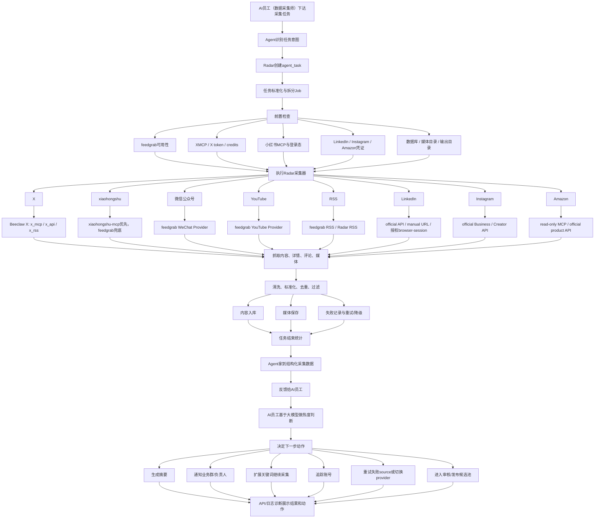

# 数据采集 Agent 落地方案

> 当前命名说明：Radar 对 AI 员工、Hermes MCP 和业务文档公开的采集引擎名称统一为 **Beeclaw**。本文中历史出现的 `feedgrab` 指 upstream feedgrab backend 或旧 provider alias；新任务、新 Skill、新 API 输出应使用 `beeclaw:*`。

## 一、建设目标

建设一个统一的数据采集工具，用来支撑千蜂 AI 员工持续采集外部公开信息和授权账号可访问的信息，形成“任务下达、意图识别、采集执行、数据入库、结果反馈、后续整理”的闭环。

本项目不是做单个平台爬虫，也不是写死一个固定 Agent。Radar 是一个可管理、可扩展、可被任意 Hermes/千蜂 AI 员工调用的多平台数据采集工具。第一阶段只要求把数据采集完整跑通：AI 员工理解采集需求，调用 Radar/Beeclaw 执行抓取，把原始内容、媒体、指标和失败原因沉淀成数据库资产。

核心目标：

- 统一入口：AI 员工通过 Radar 工具管理 X、小红书、微信公众号、YouTube、RSS、LinkedIn、Instagram、Amazon 等平台。
- 统一任务：支持自然语言任务，例如“抓取 AI 情报源最近一周带图片内容”。
- 统一数据：内容、媒体、账号、失败原因、运行报告统一入库。
- 统一管理：API/日志诊断仅用于开发、运维、诊断：查看 source、任务结果和失败原因；正式任务入口在 AI Agent。
- 统一集成：Radar 采集器输出结构化执行结果，后续可由同一个 AI 员工或独立的内容整理/分析员工继续处理。
- 合规可控：只采集公开或授权内容，不绕过登录、验证码和风控。

## 二、支持平台

Radar 采集器一期明确覆盖 8 类平台：

```text
X、xiaohongshu、微信公众号、YouTube、RSS、LinkedIn、Instagram、Amazon
```

### 1. X

X 是第一优先级平台，也是当前基础最成熟的平台。

支持方式：

- Beeclaw X provider 对外统一为 `beeclaw:x`。
- X 官方 XMCP、X API、x-rss 作为 Beeclaw 内部 backend 自动选择。
- x-rss 免费模式作为 Beeclaw / Radar 的低成本补充路径。
- browser-session 只作为显式调试路径，不进入默认生产 auto 顺序。

采集内容：

- 指定账号最近内容。
- 关键词 recent search。
- 图片、视频 metadata。
- 互动指标。
- 原文链接。
- 媒体下载。

注意点：

- XMCP 本质还是调用 X API，会消耗 X credits；合并进 feedgrab 后仍然需要保留 credits、token、allow-list 和失败原因记录。
- x-rss 是低成本路径，适合文本和图片，但不保证完整视频和严格时间窗口。

### 2. 小红书

当前本地小红书 MCP 接入点：

```text
http://localhost:18060/mcp
```

它应作为小红书 MCP provider 的本地接入点。

支持方式：

- `xpzouying/xiaohongshu-mcp`。
- 本地 MCP 服务。
- 登录态授权后采集。
- feedgrab 小红书能力作为兜底路径，用于搜索、单篇笔记、用户主页等场景。

采集内容：

- 关键词搜索。
- 笔记详情。
- 评论。
- 作者信息。
- 图片/视频链接。
- 互动数据。

落地要求：

- 增加 MCP 健康检查。
- 增加登录态检查。
- MCP 不在线时明确报错。
- 不绕过平台登录和风控。
- 采集结果统一进入 Radar 内容库。

当前状态：

- 端点当前从命令侧返回 `502 Bad Gateway`。
- 需要检查小红书 MCP 服务是否真正启动、是否受代理影响、是否需要标准 MCP initialize/session 握手。

### 3. 微信公众号

支持方式：

- feedgrab 公众号 provider。
- 微信文章 URL 读取。
- 公众号关键词搜索作为补充路径。

采集内容：

- 文章标题。
- 正文。
- 作者/公众号名称。
- 发布时间。
- 原文链接。
- 封面图和正文图片。

限制：

- 搜索路径容易受平台反爬影响。
- 优先采集明确 URL 或已授权/可公开访问的文章。

### 4. YouTube

支持方式：

- feedgrab YouTube provider。
- YouTube 搜索。
- 视频 URL 读取。
- 字幕/转录能力视可用性接入。

采集内容：

- 视频标题。
- 描述。
- 频道信息。
- 发布时间。
- 播放量、点赞等公开指标。
- 封面图。
- 字幕/转录文本。

限制：

- 字幕不一定存在。
- 公开视频可采集，私有/会员内容不采集。

### 5. RSS

支持方式：

- feedgrab RSS provider。
- Radar 自有 RSS provider。

采集内容：

- 文章标题。
- 摘要。
- 原文链接。
- 发布时间。
- 来源站点。
- 分类标签。

适用场景：

- 新闻源。
- 博客源。
- AI 情报源。
- x-rss 等低成本公开源。

### 6. LinkedIn

支持方式：

- 官方 LinkedIn API。
- manual URL 手工导入。
- browser-session 仅限授权账号。

采集内容：

- 公开或授权可访问的帖子。
- 企业账号内容。
- 链接、正文、发布时间。
- 互动指标。

限制：

- 不做绕过登录的大规模抓取。
- 企业级完整采集依赖官方 API 权限。

### 7. Instagram

支持方式：

- 官方 Instagram Business / Creator API。
- browser-session 仅作为授权账号低频补充。

采集内容：

- 授权账号媒体。
- 评论。
- insights。
- 帖子链接和发布时间。

限制：

- 不承诺无授权公开竞品批量抓取。
- 依赖 Meta 官方权限审批。

### 8. Amazon

支持方式：

- Amazon MCP 只读模式。
- 后续接 Amazon 官方商品 API。

采集内容：

- 商品搜索结果。
- 商品标题。
- 价格。
- 评分。
- 评论摘要。
- 商品链接。

边界：

- 只做读取。
- 不做加购、下单、支付等动作。

## 三、整体架构

建议以 `radar` 项目作为主项目落地，因为它已经具备：

- X 采集 provider。
- x-rss 免费源。
- Beeclaw 可作为统一 provider 层，内部封装 X MCP、X API、x-rss、小红书、微信公众号、YouTube、RSS 等抓取能力。
- 媒体下载。
- SQLite 内容库。
- API/日志诊断。
- AI 员工和后续流程可消费的结构化运行结果。
- Radar MCP Server。

整体架构：

```text
用户 / AI 员工
        |
        v
Radar Agent API / Radar MCP Server
        |
        v
任务解析层
        |
        v
采集调度层
        |
        +-- Beeclaw Provider
        |     +-- X: beeclaw:x(auto) -> x_mcp / x_api / x_rss
        |     +-- 小红书兜底抓取
        |     +-- 微信公众号 / YouTube / RSS / Web
        +-- 小红书 MCP Provider
        +-- LinkedIn Provider
        +-- Instagram Provider
        +-- Amazon Provider
        |
        v
内容入库 / 媒体下载 / 失败记录
        |
        v
结构化采集结果
        |
        v
整理 / 审核 / 通知 / 发布
```

## 四、怎么做

### 阶段一：收敛主项目

以 `radar` 为主线项目，不再另起一套系统。

保留并增强：

- `crawler/providers.py`
- `crawler/web.py`
- `crawler/hermes_agents.py`
- `crawler/hermes_reports.py`
- `tools/radar_mcp_server.py`

把采集 Agent 做成 Radar 的正式能力。

### 阶段二：统一 Agent 入口

新增统一任务入口：

```text
POST /api/agent/run
```

输入示例：

```json
{
  "prompt": "抓取小红书 AI 工具相关笔记，保留图片和评论"
}
```

Agent 解析为：

```json
{
  "platform": "xiaohongshu",
  "mode": "mcp",
  "source_type": "keyword",
  "value": "AI 工具",
  "filters": {
    "download_media": true,
    "include_comments": true
  }
}
```

执行流程：

1. 选择 provider。
2. 检查 MCP/API/token/feedgrab 环境状态。
3. 执行采集。
4. 内容去重。
5. 保存媒体。
6. 写入失败原因。
7. 生成结构化执行结果。

### 阶段三：接入 feedgrab Provider，并把 XMCP 合并进 feedgrab

feedgrab 定位为 Radar 的通用内容抓取 provider。Radar 不再直接暴露 XMCP 作为一等 provider，而是由 feedgrab 统一封装 X 平台的多种抓取路径。

feedgrab 内部 X 路由：

```text
X 采集请求
    |
    +-- 优先：XMCP / X 官方 API
    +-- 补充：x-rss
    +-- 兜底：browser-session / GraphQL / URL reader
```

Radar 侧只需要看到：

```json
{
  "platform": "x",
  "mode": "feedgrab",
  "source_type": "keyword",
  "value": "AI Agent"
}
```

这样做的好处：

- Radar 的 provider 数量减少，平台入口更清晰。
- X 的多种抓取方式由 feedgrab 内部自动路由。
- 后续微信公众号、YouTube、RSS 等平台可以复用同一个 feedgrab provider。
- AI 员工只需要调用 Radar，不需要理解 XMCP、x-rss、browser-session 的差异；后续是否做整理、分析、通知或发布，由该员工绑定的能力决定。

落地要求：

- feedgrab 增加 XMCP client，支持标准 MCP initialize/session/tools/list。
- feedgrab 内部做只读 allow-list，不暴露发帖、点赞、删除、关注等写操作。
- feedgrab 输出统一 `UnifiedContent`，Radar 再转换为 `source_contents`。
- XMCP 失败时返回结构化错误，例如 `xmcp_unavailable`、`x_credits_depleted`、`x_auth_failed`。

### 阶段四：接入小红书 MCP

针对当前本地端点：

```text
http://localhost:18060/mcp
```

实现能力：

- MCP initialize/session/tools/list 健康检查。
- 登录态检查。
- 搜索笔记。
- 获取笔记详情。
- 获取评论。
- 保存图片/视频 metadata。
- 失败状态可视化。

失败状态包括：

- `mcp_unavailable`
- `login_required`
- `search_empty`
- `note_detail_failed`
- `rate_limited`
- `media_download_failed`

小红书采集策略：

```text
优先：xiaohongshu-mcp
兜底：feedgrab xhs / xhs-so / xhs_user_notes
```

### 阶段五：可选接入整理/分析能力

Radar 每次采集完成后生成结构化执行结果。它不是最终分析报告，而是给当前 AI 员工或后续整理/分析流程使用的“任务回执 + 原始素材索引 + 失败清单”。

```json
{
  "agent_name": "radar_crawl_agent",
  "run_type": "crawl",
  "status": "success",
  "success_count": 20,
  "failure_count": 1,
  "top_items": [],
  "failed_items": [],
  "raw_items": [],
  "failed_items": []
}
```

后续整理/分析能力可以负责：

- 读取结构化采集结果。
- 调用大模型理解内容价值。
- 对内容做摘要、分类、打分和去重判断。
- 判断是否需要补采、重试、扩展关键词或切换 provider。
- 生成老板/运营可读的日报、周报或专题分析。
- 发送飞书/群通知。
- 推动进入整理、审核、发布流程。

## 五、最终效果

### 对业务侧

老板或运营只需要输入任务：

```text
抓取 X 和小红书上 AI Agent 相关的热门内容，保留图片和评论，生成今日情报摘要。
```

系统自动完成：

- 平台识别。
- source 创建。
- provider 选择，X 统一走 feedgrab 内部路由。
- 内容采集。
- 媒体保存。
- 失败记录。
- 结构化采集结果。
- 后续整理通知。

### 对管理侧

API/日志诊断可以看到：

- 平台状态。
- MCP 是否在线。
- feedgrab 是否可用。
- token 是否配置。
- source 列表。
- 采集任务。
- 成功/失败数量。
- 失败原因。
- 最新内容。
- 媒体资产。
- 内容整理 Agent 处理结果。

### 对技术侧

形成稳定扩展框架：

- 新平台只需要新增 provider。
- X 的 XMCP、API、x-rss 由 Beeclaw 统一封装，Radar 不需要维护多套 X provider 入口。
- 新工作流只需要新增 Agent task。
- 新输出渠道只需要接结构化执行结果。
- 采集失败不会静默丢失，而是结构化记录。

## 六、风险与边界

主要风险：

- X XMCP 合并进 feedgrab 后仍消耗 X API credits，不是免费绕过。
- Instagram / LinkedIn 依赖官方授权审批。
- 小红书 MCP 依赖本地登录态和 MCP 稳定性。
- feedgrab 中的 browser fallback、GraphQL 等能力必须受开关控制，默认只读、默认合规。
- Amazon MCP 当前更偏购物助手，需要限制为只读。
- browser-session 模式容易触发平台风控，默认不作为主路径。

合规边界：

- 不采集私密内容。
- 不绕过验证码、登录和权限控制。
- 不做自动点赞、发帖、评论、购买。
- 不做敏感画像或自动化个人决策。
- 所有失败和权限问题必须显式记录，不能静默假成功。

## 七、汇报结论

这个项目的核心价值是把分散的平台采集能力，统一成一个可管理、可审计、可被任意 Hermes/千蜂 AI 员工调用的数据采集工具。

短期重点：

1. 以 `radar` 为主项目。
2. 引入 feedgrab 作为通用 provider，并把 X 官方 XMCP 合并进 feedgrab 内部。
3. 打通 X + 小红书两个核心平台。
4. 把小红书 MCP `localhost:18060/mcp` 做成稳定 provider，并用 feedgrab 小红书能力做兜底。
5. 让每次采集都输出 AI 员工和后续流程可消费的结构化执行结果。
6. 在API/日志诊断展示运行状态和失败原因。

最终效果是：业务人员不用关心 API、MCP、token、登录态等底层细节，只需要提出采集目标，Agent 自动完成采集、沉淀和流转；技术侧则通过 feedgrab 统一承载 X/XMCP 及多平台抓取能力，通过 Radar 统一承载业务状态和 Hermes 集成。

## 八、端到端数据采集流程

本节描述从 AI 员工（数据采集师）下达采集任务，到 Agent 识别意图、执行 Radar 采集器、拿到采集数据、反馈给 AI 员工，再由 AI 员工做数据热度判断和下一步动作的完整流程。

### 流程图



核心链路：

```text
AI 员工（数据采集师）
        |
        v
下达采集任务
        |
        v
Agent 识别意图
        |
        v
执行 Radar 采集器
        |
        v
Agent 拿到采集数据
        |
        v
反馈给 AI 员工
        |
        v
AI 员工做热度判断和下一步动作
```

### 1. Agent 下达采集任务

任务入口来自 AI 员工（数据采集师）或 Hermes MCP 调用；Radar API/日志诊断不作为用户入口。

输入可以是自然语言：

```text
抓取 X 和小红书上 AI Agent 相关的热门内容，保留图片和评论，生成今日情报摘要。
```

也可以是结构化任务：

```json
{
  "platforms": ["x", "xiaohongshu"],
  "keyword": "AI Agent",
  "time_range": "7d",
  "media_only": true,
  "include_comments": true,
  "output": "structured_result"
}
```

任务进入 Radar 后，首先生成一条 `agent_task` 记录，记录：

- 任务来源：AI 员工 / MCP；API/日志诊断仅用于诊断和回放。
- 原始 prompt。
- 任务发起人。
- 任务创建时间。
- 当前状态：`created`。

### 2. 任务解析与标准化

Agent 对任务做意图识别和标准化，转换为 Radar 采集器可执行的采集计划。

解析内容包括：

- 业务意图：热点监控、竞品观察、选题发现、账号跟踪、商品/平台动态监控。
- 平台：X、小红书、YouTube、公众号等。
- source 类型：账号、关键词、URL、RSS、列表。
- 采集模式：feedgrab、小红书 MCP、官方 API、manual URL。
- 时间范围：最近一天、最近一周、自定义日期。
- 过滤条件：是否只要带图片/视频内容、最低互动量、语言、地区。
- 输出方式：内容库、媒体资产、结构化执行结果。

示例解析结果：

```json
{
  "task_id": "task_20260513_001",
  "sources": [
    {
      "platform": "x",
      "mode": "feedgrab",
      "source_type": "keyword",
      "value": "AI Agent",
      "filters": {
        "time_range": "7d",
        "media_only": true
      }
    },
    {
      "platform": "xiaohongshu",
      "mode": "mcp",
      "source_type": "keyword",
      "value": "AI Agent",
      "filters": {
        "include_comments": true,
        "download_media": true
      }
    }
  ]
}
```

任务状态更新为：`planned`。

### 2.1 意图识别结果

意图识别后，Agent 会形成一个明确的执行意图。

示例：

```json
{
  "intent": "hot_content_discovery",
  "business_goal": "发现 AI Agent 相关高热内容和潜在选题",
  "target_platforms": ["x", "xiaohongshu"],
  "decision_requirements": [
    "判断内容热度",
    "判断是否值得进入日报",
    "判断是否需要扩展关键词继续采集"
  ]
}
```

这一步的结果会随采集计划一起传给 Radar 采集器。

### 3. 前置检查

执行前先做环境和权限检查。

检查项：

- feedgrab 是否可调用。
- feedgrab 内部 XMCP 是否可用。
- X token / credits 是否可用。
- 小红书 MCP `http://localhost:18060/mcp` 是否在线。
- 小红书登录态是否有效。
- 输出目录、数据库、媒体目录是否可写。
- 是否开启了 browser-session 等高风险模式。

检查结果会写入任务上下文：

```json
{
  "feedgrab": "ready",
  "xmcp": "ready",
  "xiaohongshu_mcp": "unavailable",
  "browser_session": "disabled"
}
```

如果核心依赖不可用，有两种处理方式：

- 可降级：例如 X 的 XMCP 不可用时，降级到 x-rss。
- 不可降级：例如小红书 MCP 不在线且未启用 feedgrab 兜底，则该 source 标记失败。

任务状态更新为：`validated` 或 `partial_ready`。

### 4. 任务拆分与队列化

一个自然语言任务会拆成多个可执行子任务。

例如：

```text
抓取 X 和小红书上 AI Agent 相关内容
```

会拆成：

```text
job_1: X / feedgrab / keyword / AI Agent
job_2: 小红书 / xiaohongshu-mcp / keyword / AI Agent
job_3: 小红书 / feedgrab fallback / keyword / AI Agent
```

每个 job 记录：

- source。
- provider。
- 参数。
- 重试次数。
- 超时时间。
- 当前状态。

任务状态更新为：`running`。

### 5. Provider 路由

Radar 根据平台和模式选择 provider。

X 路由：

```text
Radar -> Beeclaw Provider
             |
             +-- beeclaw:x(auto)
             +-- x_mcp / x_api / x_rss 自动选择
             +-- browser-session 仅显式调试
```

小红书路由：

```text
Radar -> xiaohongshu-mcp Provider
             |
             +-- MCP 搜索
             +-- 笔记详情
             +-- 评论
             +-- 媒体信息

失败时：

Radar -> feedgrab XHS Provider
             |
             +-- xhs-so 搜索
             +-- 单篇笔记读取
             +-- 用户主页笔记
```

其他平台路由：

```text
YouTube / Bilibili / 公众号 / RSS / Web
        |
        v
feedgrab Provider
```

### 6. 内容抓取

Provider 开始执行实际采集。

采集过程包括：

- 请求列表页、搜索接口或 MCP tool。
- 分页或滚动加载。
- 获取详情页。
- 提取正文、标题、作者、发布时间。
- 提取互动数据。
- 提取图片和视频 URL。
- 提取评论或转发信息。
- 记录原始响应或关键 raw payload。

每条内容会先形成统一中间结构：

```json
{
  "platform": "x",
  "source": "feedgrab",
  "external_id": "123456789",
  "author": "OpenAI",
  "title": "示例标题",
  "content": "正文内容",
  "url": "https://x.com/...",
  "published_at": "2026-05-13T10:00:00+08:00",
  "metrics": {
    "likes": 1200,
    "reposts": 80,
    "comments": 40
  },
  "media": [
    {
      "type": "image",
      "url": "https://..."
    }
  ]
}
```

### 7. 清洗、标准化与去重

抓取结果进入 Radar 标准化层。

处理动作：

- 标准化平台字段。
- 统一时间格式。
- 清洗正文。
- 提取 hashtags、mentions、链接。
- 生成稳定内容 ID。
- 按 `platform + external_id` 或 `url hash` 去重。
- 判断是否符合过滤条件。

过滤规则示例：

- 不符合时间范围，丢弃。
- 开启 `media_only` 但无媒体，丢弃。
- 低于最低互动阈值，降级为低优先级。
- 重复内容，更新指标但不重复入库。

### 8. 内容入库

标准化后的内容写入 Radar 内容库。

主要写入：

- `source_contents`
- `media_assets_json`
- `crawl_failures`
- `agent_runs`
- `app_settings`

内容状态初始化：

```text
organize_status = pending
review_status = pending
publish_status = pending
```

如果是 Hermes/飞书工作流，还会写入：

```text
content_index
Markdown 文件
结构化执行结果 JSON
```

### 9. 媒体处理

如果任务开启媒体下载：

```json
{
  "download_media": true
}
```

系统会：

- 下载图片。
- 保存视频 URL 或可下载视频文件。
- 生成本地 media path。
- 写入媒体 metadata。
- 记录下载失败原因。

典型路径：

```text
data/media/{platform}/{handle_or_source}/{content_id}/image_001.jpg
```

媒体失败不会导致整条内容失败，但会记录：

```text
media_download_failed
```

### 10. 失败处理与重试

采集中任何阶段失败，都不会静默吞掉。

失败类型包括：

- `mcp_unavailable`
- `xmcp_unavailable`
- `x_credits_depleted`
- `token_invalid`
- `login_required`
- `rate_limited`
- `search_empty`
- `detail_fetch_failed`
- `media_download_failed`
- `browser_session_disabled`

处理策略：

- 可重试错误：网络超时、临时 5xx、部分 rate limit。
- 可降级错误：XMCP 失败降级 x-rss，xiaohongshu-mcp 失败降级 feedgrab。
- 不可自动处理错误：登录失效、token 无效、credits 不足。

每个失败都写入：

- 失败 source。
- 失败 provider。
- 错误类型。
- 错误消息。
- 是否可重试。
- 下一步建议。

### 11. 任务结束与统计

所有 job 执行结束后，Radar 汇总任务结果。

统计指标：

- 总 source 数。
- 总 job 数。
- 成功 job 数。
- 失败 job 数。
- 采集内容数。
- 去重内容数。
- 媒体数量。
- 下载成功数量。
- 下载失败数量。
- 各平台分布。

任务状态更新为：

- `success`：全部成功。
- `partial_success`：部分成功。
- `failed`：全部失败。

### 12. Agent 拿到采集数据并生成结构化执行结果

Radar 采集器完成执行后，Agent 拿到采集数据，并生成 AI 员工可消费的结构化执行结果。这里不做最终业务判断，不替代 AI 员工的大模型推理，只负责把“采集发生了什么、拿到了什么、失败了什么、素材在哪里”说清楚。

结果示例：

```json
{
  "agent_name": "radar_crawl_agent",
  "run_id": "crawl_20260513_001",
  "run_type": "crawl",
  "status": "partial_success",
  "started_at": "2026-05-13T10:00:00+08:00",
  "finished_at": "2026-05-13T10:08:00+08:00",
  "total_count": 80,
  "success_count": 72,
  "failure_count": 8,
  "category_stats": {
    "x": 40,
    "xiaohongshu": 32
  },
  "top_items": [
    {
      "title": "高互动内容标题",
      "platform": "x",
      "account": "OpenAI",
      "url": "https://x.com/..."
    }
  ],
  "failed_items": [
    {
      "platform": "xiaohongshu",
      "provider": "xiaohongshu-mcp",
      "error_type": "mcp_unavailable",
      "error_message": "localhost:18060/mcp unavailable"
    }
  ],
  "raw_items": [],
  "operator_hints": [
    "小红书 MCP 登录态可能失效",
    "X 高互动内容建议进入整理/分析流程做摘要判断"
  ]
}
```

### 13. 可选后续整理/分析处理

AI 员工接收结构化执行结果后，可以基于已绑定的大模型能力继续处理。这个能力可以在同一个采集员工里，也可以拆成独立的内容整理员工。

处理动作：

- 读取 `top_items`。
- 读取原始正文、媒体说明、互动指标和失败原因。
- 用大模型判断内容价值、可信度、时效性、业务相关性和传播热度。
- 生成摘要、分类、观点提炼和行动建议。
- 判断是否需要补采、扩展关键词或切换采集源。
- 整理为日报、周报或专题分析。
- 把失败项通知给技术或运营。
- 把待审核内容推送到飞书/审核队列。
- 对已审核内容进入发布流程。

AI 员工不直接处理底层平台采集细节，它消费 Radar 的结构化结果，并负责智能推理和业务决策。

### 13.1 数据热度判断

AI 员工会对采集结果做热度判断。判断维度包括：

- 平台互动量：点赞、转发、评论、收藏、播放量。
- 增长速度：短时间内互动增长是否异常。
- 账号权重：发布账号是否为核心账号、行业 KOL、官方账号。
- 内容相关性：是否与当前业务主题、产品方向、市场动态相关。
- 新鲜度：发布时间是否在任务要求的时间窗口内。
- 媒体价值：是否带有图片、视频、截图、产品演示等可复用素材。
- 传播潜力：是否适合进入日报、周报、选题库或销售/市场素材库。

热度判断输出示例：

```json
{
  "item_id": "x_123456",
  "heat_level": "high",
  "reason": "官方账号发布，互动增长快，内容与 AI Agent 产品方向高度相关",
  "recommended_action": "进入今日情报摘要，并扩展采集相关关键词"
}
```

### 13.2 下一步动作决策

AI 员工基于热度判断决定下一步动作。

可选动作：

- `summarize`：生成摘要。
- `notify`：通知业务群或负责人。
- `expand_search`：扩展关键词继续采集。
- `track_account`：把账号加入长期监控。
- `retry_failed_source`：重试失败 source。
- `send_to_review`：进入人工审核。
- `publish_candidate`：进入待发布候选池。
- `ignore`：低价值内容忽略。

示例：

```json
{
  "task_id": "task_20260513_001",
  "next_actions": [
    {
      "action": "summarize",
      "target": "top_items",
      "reason": "高热内容数量达到日报阈值"
    },
    {
      "action": "expand_search",
      "target": "AI Agent workflow",
      "reason": "多个高热内容共同指向 workflow 相关趋势"
    },
    {
      "action": "retry_failed_source",
      "target": "xiaohongshu-mcp",
      "reason": "小红书 MCP 登录态异常"
    }
  ]
}
```

### 14. API/日志诊断诊断展示

任务结束后，API/CLI展示：

- 本次任务状态。
- 各平台成功/失败数量。
- MCP/API/feedgrab 状态。
- 最新采集内容。
- 媒体预览。
- 失败原因。
- 结构化结果链接。
- 可重试任务。

运营可以在API/CLI完成：

- 重新运行失败任务。
- 调整 source。
- 开关 provider。
- 诊断内容详情。
- 标记审核状态。

### 15. 完整流程总结

完整链路如下：

```text
AI 员工（数据采集师）下达采集任务
        |
        v
Radar 创建 agent_task
        |
        v
Agent 识别意图并标准化任务
        |
        v
前置检查：feedgrab / XMCP / 小红书 MCP / token / 登录态
        |
        v
拆分 job 并进入队列
        |
        v
执行 Radar 采集器
        |
        +-- X
        +-- xiaohongshu
        +-- 微信公众号
        +-- YouTube
        +-- RSS
        +-- LinkedIn
        +-- Instagram
        +-- Amazon
        |
        v
Provider 路由
        |
        +-- feedgrab: X / 微信公众号 / YouTube / RSS / Web / 小红书兜底
        +-- xiaohongshu-mcp: 小红书专用采集
        +-- official API: LinkedIn / Instagram / Amazon
        |
        v
抓取内容、详情、评论、媒体
        |
        v
清洗、标准化、去重、过滤
        |
        v
内容入库 + 媒体保存 + 失败记录
        |
        v
任务统计与状态更新
        |
        v
Agent 拿到采集数据并生成结构化执行结果
        |
        v
反馈给 AI 员工
        |
        v
AI 员工做数据热度判断和下一步动作决策
        |
        v
API/日志诊断展示结果和失败原因
```
